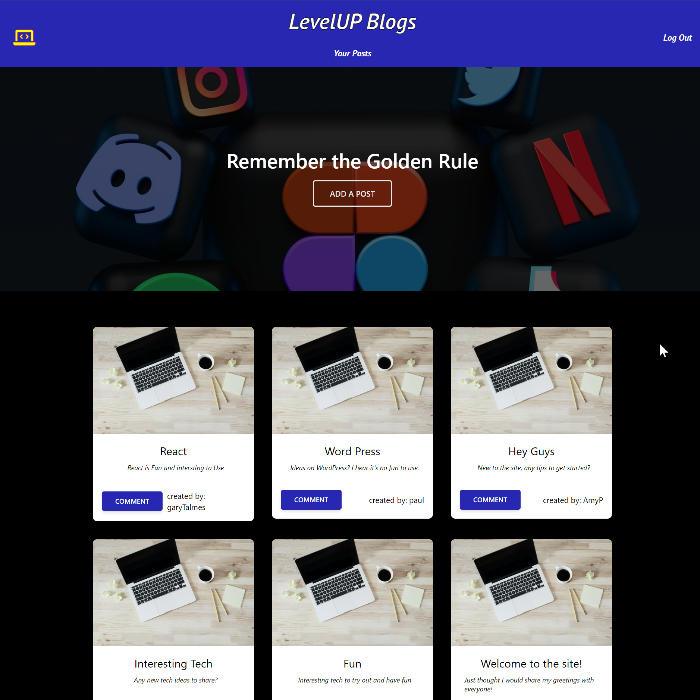
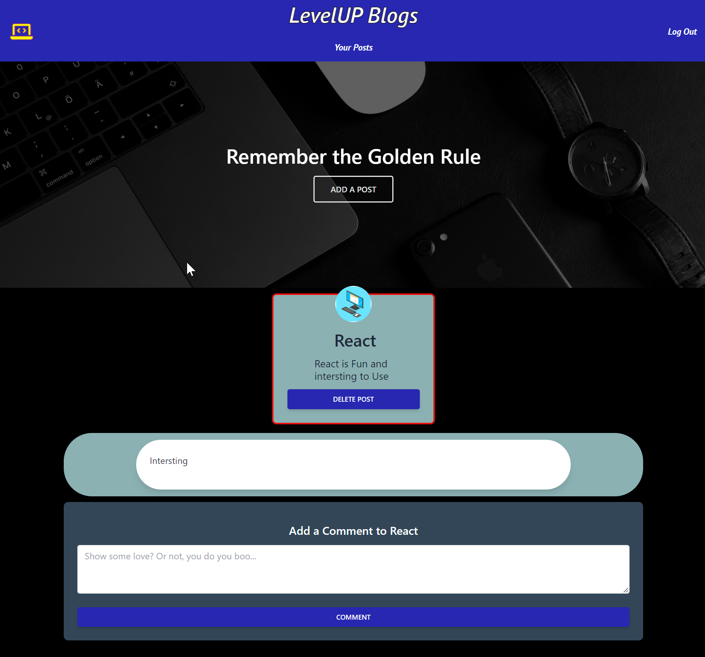

# LevelUP Blogs
-------

## Table of Content

- [Description](#description)
- [Images](#images)
- [GitHub Repository](#github-repository)
- [Author](#author)  
- [Contributors](#contributors)
- [Technologies Used](#technologies-used) 
- [License](#license)

-------
## Description:  

In this excersice we were to demostrate using handlebars, express, and javascript to create a functioning blog site that allows users to log in and create posts. In these posts the functionality to  delete or update their posts as well as comment on others posts. 

### Screenshots

## Contributors

- [Kelly Jefferies](https://github.com/ksjefferies)
- [Eugene Ahn](https://github.com/eugene125)
- [Victor Kennedy](https://github.com/Victorini1)
- [Stephen Elliott](https://github.com/UsernameisStephen)

## Technologies Used:

- [Express.js](https://expressjs.com/)
- [Express-session](https://expressjs.com/en/resources/middleware/session.html)
- [Handlebars](https://handlebarsjs.com/)
- [Node](https://nodejs.org/en/)
- [MySql2](https://www.npmjs.com/package/mysql2)
- [Bcrypt](https://www.npmjs.com/package/bcrypt)
- [Sequelize](https://sequelize.org/)
- [Dotenv](https://www.npmjs.com/package/dotenv)
- [Nodemon](https://www.npmjs.com/package/nodemon)
- [Tailwindcss](https://tailwindcss.com/)

## License:

